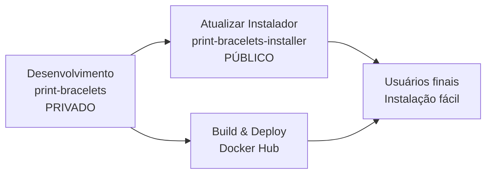

# Como criar o repositório público de instalação

## 1. Criar novo repositório no GitHub
- Nome: `print-bracelets-installer` 
- Visibilidade: **Público**
- Descrição: "Sistema de Impressão de Pulseiras - Instalador Automático"

## 2. Subir apenas os arquivos de distribuição
```bash
cd distribuicao
git init
git add .
git commit -m "feat: sistema de instalação automática"
git branch -M main
git remote add origin https://github.com/MatheuzSil/print-bracelets-installer.git
git push -u origin main
```

## 3. Estrutura do repo público (apenas essencial)
```
📁 print-bracelets-installer/
├── README.md           # Instruções de instalação
├── install.ps1         # Script de instalação
└── .gitignore          # Ignorar arquivos temporários
```

## 4. Vantagens desta estratégia

### ✅ Código principal protegido
- Repositório principal (`print-bracelets`) permanece **privado**
- Código-fonte, lógica de negócio e segredos ficam ocultos
- Apenas você tem acesso ao desenvolvimento

### ✅ Instalação pública e fácil  
- Repositório de instalação (`print-bracelets-installer`) é **público**
- Usuários conseguem instalar com 1 comando
- README limpo focado apenas na instalação
- Link direto funciona para qualquer pessoa

### ✅ Controle de versões separado
- Deploy de novas versões: atualiza Docker Hub
- Mudanças no instalador: atualiza repo público
- Versionamento independente

### ✅ Marketing e distribuição
- Repo público aparece nas buscas do GitHub
- Pode receber stars, forks, issues
- Facilita compartilhamento e adoção

## 5. Fluxo de trabalho



## 6. Links finais
- **Instalação**: `https://github.com/MatheuzSil/print-bracelets-installer`
- **Docker Hub**: `https://hub.docker.com/r/matheuzsilva/print-bracelets`
- **Desenvolvimento**: `https://github.com/MatheuzSil/print-bracelets` (privado)

---

**Resultado: Código protegido + Instalação pública e fácil! 🎯**
